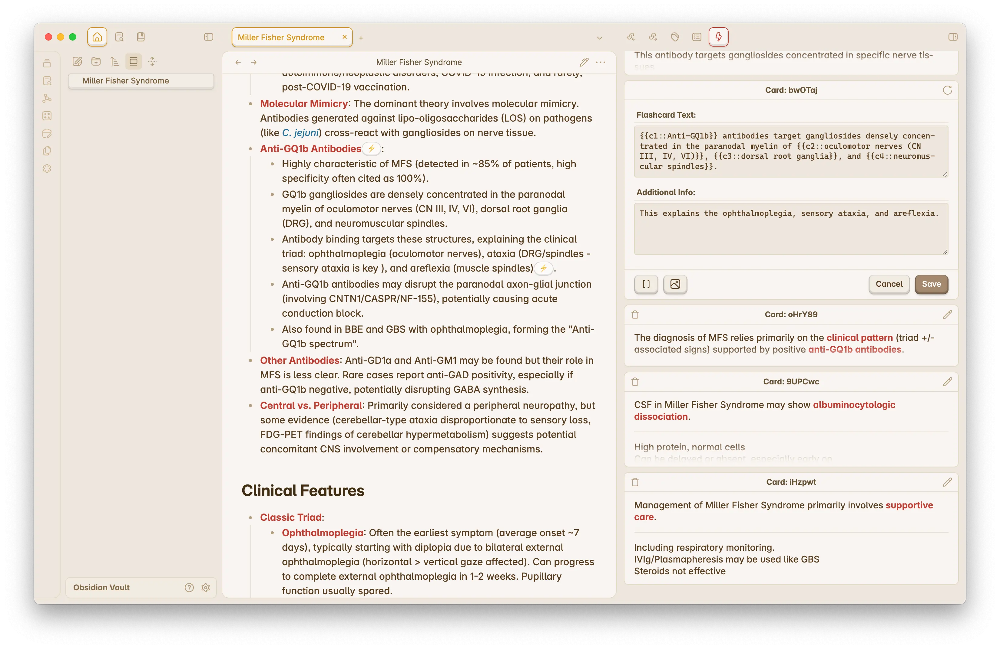
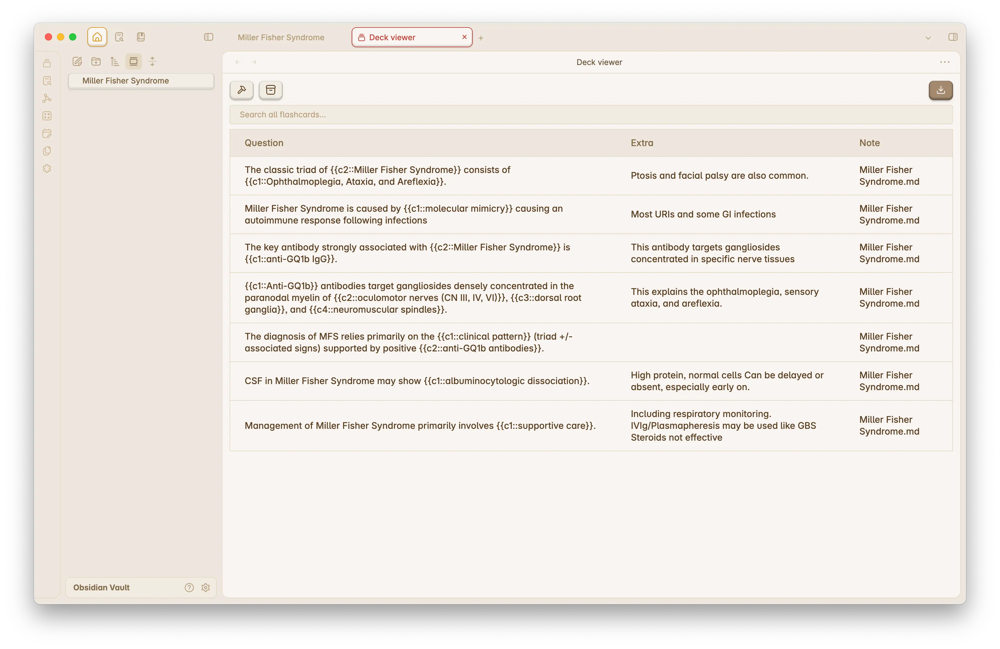

# Side Cards

> [!IMPORTANT]
> This project is currently under development and is missing several features.

Side Cards is a flashcard plugin for Obsidian, designed to integrate flashcards into your notes. The plugin allows you to export flashcards to Anki for efficient review. Unlike traditional flashcard systems, Side Cards embeds flashcards minimally within your notes using tags, enabling co-location with source material without cluttering your documents.

## Development Setup

To get started with this project, clone the repository, install the dependencies (using [Bun](https://bun.sh/) as the package manager), and run the following command:

```bash
bun dev
```

## Screenshots

### Flashcards/Notes View



### Deck Manager


